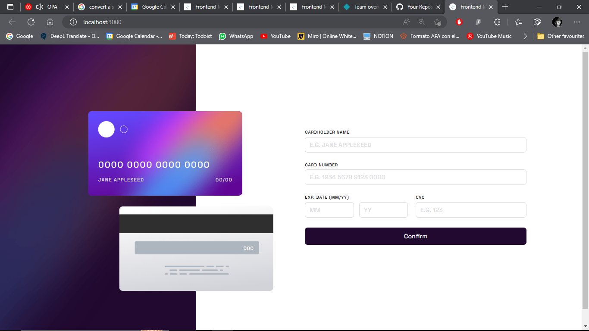

# Frontend Mentor - Interactive card details form solution

This is a solution to the [Interactive card details form challenge on Frontend Mentor](https://www.frontendmentor.io/challenges/interactive-card-details-form-XpS8cKZDWw). Frontend Mentor challenges help you improve your coding skills by building realistic projects. 

## Table of contents

- [Overview](#overview)
  - [The challenge](#the-challenge)
  - [Screenshot](#screenshot)
  - [Links](#links)
- [My process](#my-process)
  - [Built with](#built-with)
  - [What I learned](#what-i-learned)
  - [Useful resources](#useful-resources)
- [Author](#author)
- [Acknowledgments](#acknowledgments)

## Overview

### The challenge

Users should be able to:

- Fill in the form and see the card details update in real-time
- Receive error messages when the form is submitted if:
  - Any input field is empty
  - The card number, expiry date, or CVC fields are in the wrong format
- View the optimal layout depending on their device's screen size
- See hover, active, and focus states for interactive elements on the page

### Screenshot

### Links

- Solution URL: [https://github.com/GaelXoconoxtle/2-JUNIOR-interactive-card-details-form-main-by-GaelXoconoxtle/tree/main](https://github.com/GaelXoconoxtle/2-JUNIOR-interactive-card-details-form-main-by-GaelXoconoxtle/tree/main)
- Live Site URL: [https://interactivecarddetails-gaelxoconoxtle.netlify.app/](https://interactivecarddetails-gaelxoconoxtle.netlify.app/)

## My process

### Built with

- Semantic HTML5 markup
- CSS custom properties
- Flexbox
- CSS Grid
- Mobile-first workflow
- SCSS Workflow

### What I learned

Whoa! I learned a lot with this challenge but, I think the most important think I learned was to use google... Right now I feel that I can do anything because if there´s something that I don't know how to solve, all that I have to do is search for a solution on google.

### Useful resources

- [Responsive Design](https://github.com/titouanck/Interactive-card-details-form) - Dude, I love u, my goal was to get a completely responsive webpage and you did it, i learned a lot from you.

- [Form Validation using JS](https://www.javascripttutorial.net/javascript-dom/javascript-form-validation/) - This was an amazing article about how to make a form validation using JS, thank you.

## Author

- Website - [Gael Xoconoxtle](https://linktr.ee/X0C0)
- Frontend Mentor - [@GaelXoconoxtle](https://www.frontendmentor.io/profile/GaelXoconoxtle)
- Twitter - [@GaelXoconoxtle](https://twitter.com/GaelXoconoxtle)

## Acknowledgments

Again, thank's to titouanck and JavaScript TUTORIAL website.